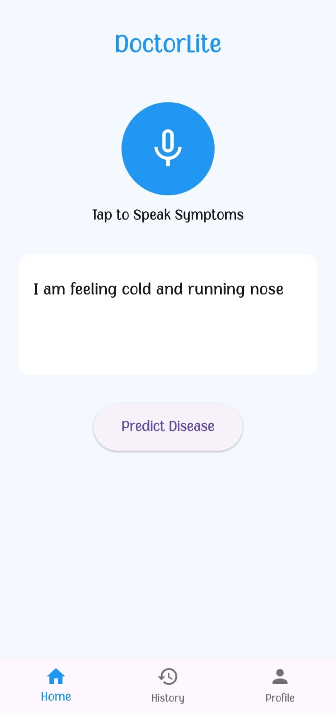
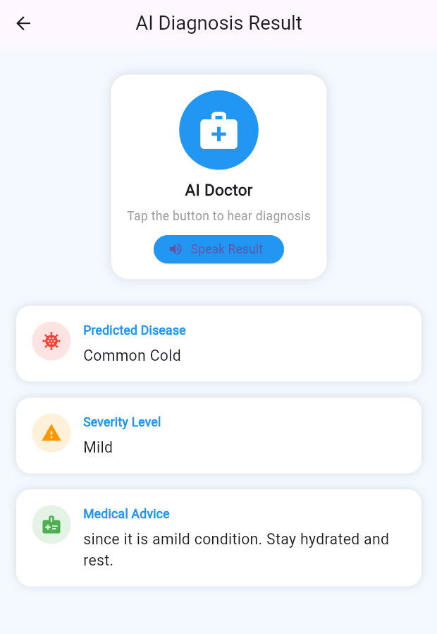
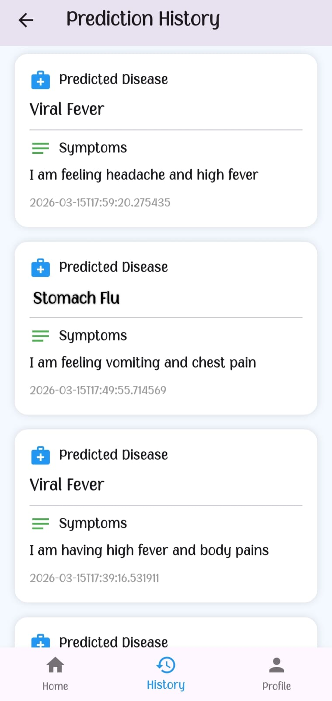

# 🩺 DoctorLite – Voice-Based AI Health Assistant


---

**DoctorLite** is a voice-enabled AI healthcare application that predicts diseases from user symptoms using **voice or text input** and provides results through **audio output and on-screen display**. It combines **Flutter**, **FastAPI**, and **Machine Learning** to deliver real-time predictions with severity analysis and medical advice.

---

## 🚀 Key Features

* 🎤 Voice-based symptom input
* ⌨️ Text-based symptom input
* 🤖 AI-driven disease prediction
* 📊 Severity analysis with advice
* 🔊 Voice output for results
* 🕒 Prediction history tracking
* 👤 User profile management

---

## 🛠️ Tech Stack

* **Frontend:** Flutter
* **Backend:** FastAPI
* **Machine Learning:** Random Forest, NLP (Fuzzy Matching)
* **Database & Auth:** Supabase

---

## ⚙️ Workflow

1. User enters symptoms via voice or text
2. Input is sent to FastAPI backend
3. NLP extracts symptoms
4. ML models predict disease and severity
5. Results are returned with advice
6. Output is displayed and spoken aloud
7. Data is stored for history tracking

---

## 📱 Screenshots

<p align="center">
  
  
  
</p>
---

## ▶️ Run the Project

### Backend

```bash
cd backend
pip install -r requirements.txt
uvicorn main:app --reload
```

### Frontend

```bash
cd frontend
flutter pub get
flutter run
```

---

## 👩‍💻 Developer

**K. Divyasri**  
Aspiring Software Developer | Flutter | FastAPI | AI/ML

---

## ⭐

If you found this useful, consider giving it a star.
